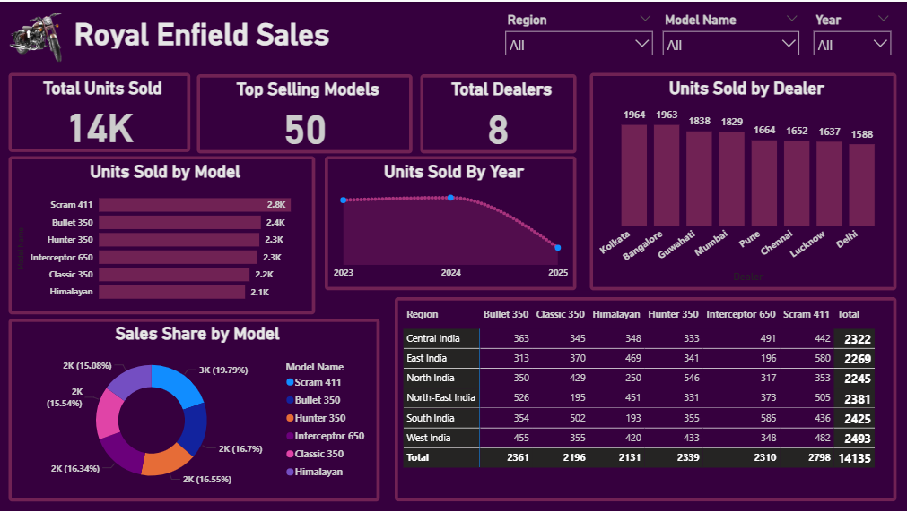

📝 README.md
# 👥 Royal Enfield Sales Analysis Dashboard (Power BI)
This project showcases a data visualization dashboard built in Power BI to analyze bullet sales performance. It provides insights into sales trends, model performance, regional distribution, dealer rankings, and customer preferences by color variant.

## 📊 Key Features
KPI Cards → Total Units Sold, Top-Selling Model, Best Region, Dealer Count
Sales Trend Analysis → Monthly sales trend with slicers for Year, Model, and Region
Model Performance → Bar chart (units sold by model) and Pie/Donut chart (sales share by model)
Regional Insights → Matrix (Region × Model Sales)
Dealer Performance → Ranked table highlighting Top Dealers by sales volume
Color Analysis → Treemap/Bar chart showing most popular color variants

## 🛠 Tools & Technologies
Power BI Desktop
DAX (Data Analysis Expressions) for KPIs & calculations
Excel as the data source

## 📌 Overview
Identifying top-performing models and regions
Monitoring dealer performance
Understanding customer preferences by color
Supporting strategic decisions in sales & marketing

## 📸 Dashboard Preview

